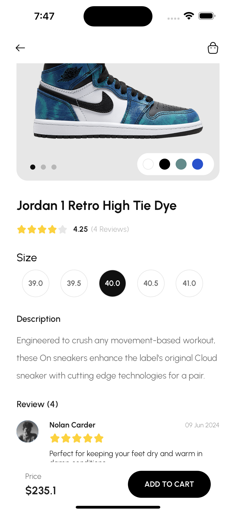

### Code Test Name: shoesly_flutter
A code test mobile application for Priority Soft

## I. Project Setup Instructions:

1. **Flutter Setup:**
    - Ensure you have Flutter installed. If not, follow the instructions [Link](https://flutter.dev/docs/get-started/install) to set up Flutter on your laptop or desktop.
    - Clone this repository to your local laptop:
      ```
      git clone <repository_url>
      ```
    - Navigate to the project directory in your terminal.
    - Or you can use the url in your Github Desktop [Link](https://github.com/joemdjossou/shoesly_flutter.git)

2. **Firebase Setup:**
    - Obtain the necessary Firebase configuration files like the Firebase CLI to start
    - The API KEY and data has been secured in an .env file to leverage the usability for all
    - Fetch the packages by pressing the command:
      ```
      pub get
      ```
   - You can also follow the instructions given in the Firebase documentation for installation: [Link](https://firebase.google.com/docs/flutter/setup?platform=ios)

3. **Running the Application:**
    - Here we go! Once Flutter and Firebase are set up, run the application on a simulator or a physical device using:
      ```
      flutter run
      ```

## II. Assumptions Made During Development:

- **Design feedback:** The development process was based on the expectation that the Figma design would be adhered to strictly. Nevertheless, minor adjustments or improvements to enhance user experience and functionality were allowed with some adjustments on the shoes pictures that were not of good quality.

- **App Interactivity:** It was anticipated that the majority of the application content would be dynamic. As a result, Firebase integration was prioritized to enable smooth management, updating of content with also the addition of some snack bars notification while making steps in in the app.

- **Design and functionalities:** The functionalities are much more important than the user interface, but without a good interface the users will not even check the functionalities, so a balance between the two was found

## III. Challenges Faced and Overcoming Them:

- During the development phase, one significant challenge was setting up a Firebase function to compute averages from the cloud, due to the associated billing plan. Instead, reviews are dynamically processed within the app using a local function that automatically fetches and computes the average, avoiding manual intervention

- Effectively using Firestore's document-based structure was manageable but required a solid understanding of relational databases for optimal implementation. 

- The given time frame was moderate, neither short nor long. However, this period was insufficient to perfect the product application, particularly with regard to unit testing...

## IV. Additional Features or Improvements:

- **Firebase Storage:** Comprehensive integration with Firebase Storage was carried out to facilitate real-time data synchronization and efficient content management.

- **Boosted performance:** Performance optimization techniques were implemented to ensure the application operates smoothly and responsively across various devices and platforms.

---

## App Review

### App Local Image

<div style="display: flex; justify-content: center;">
    
    
    
    
    
    
    
    
</div>


Above are images showcasing the app.


